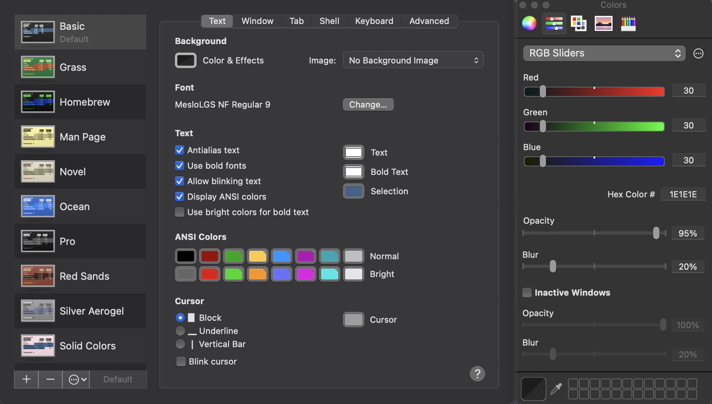
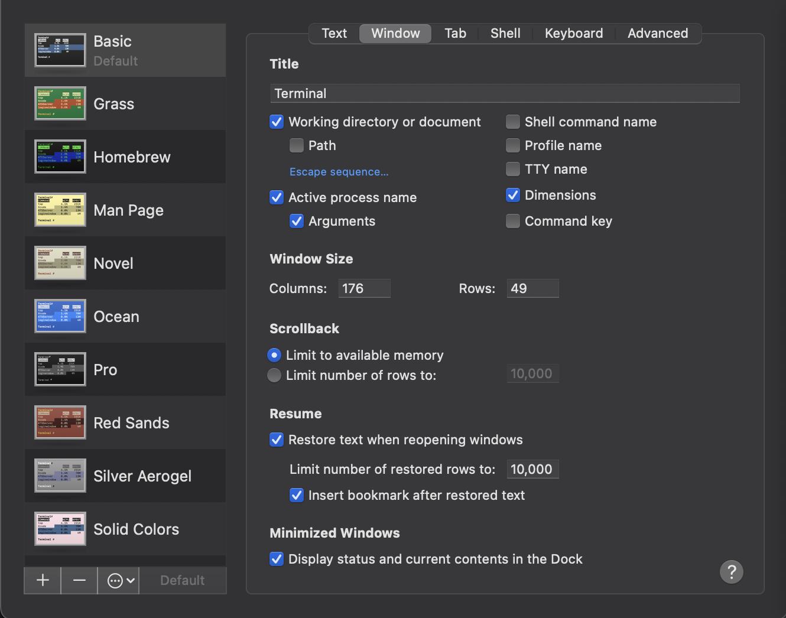
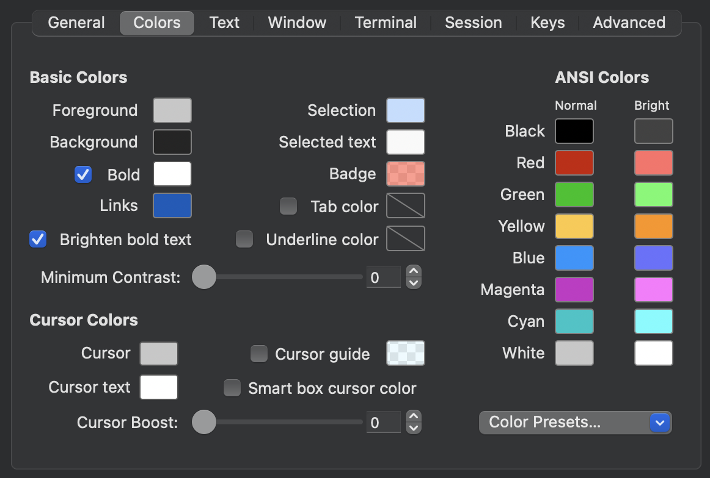
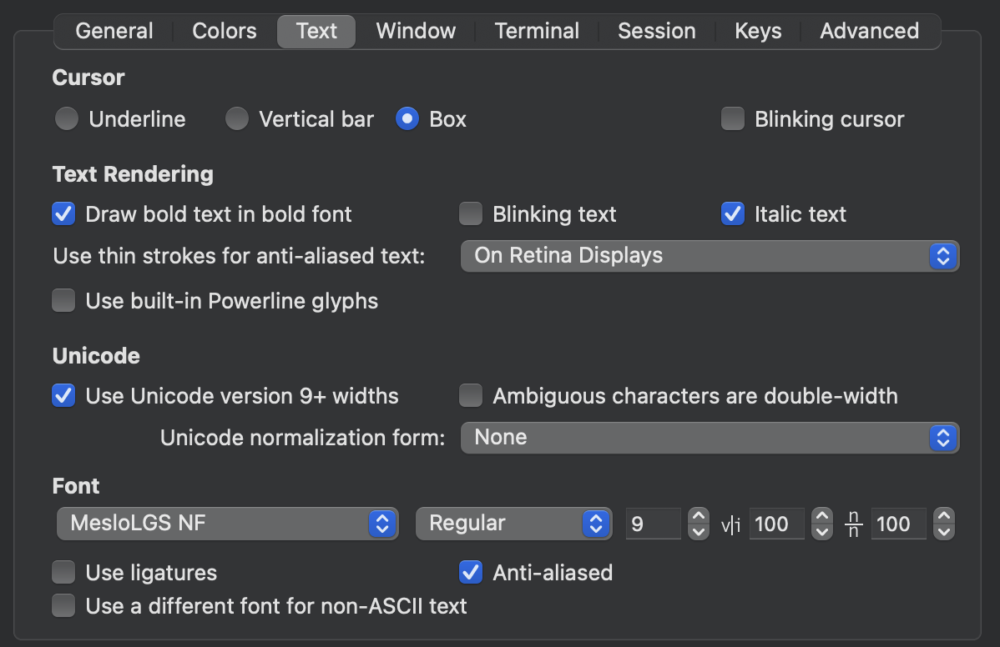
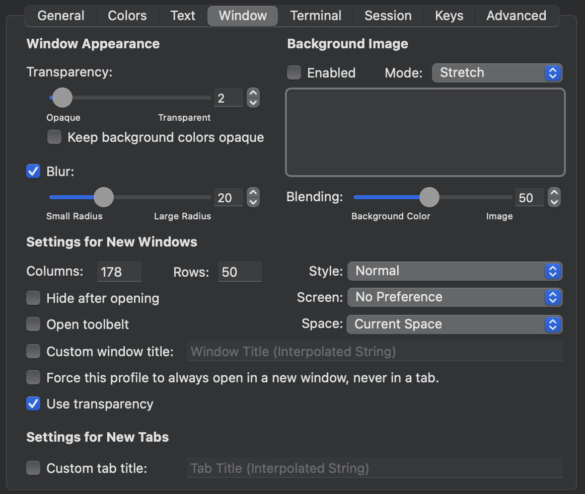
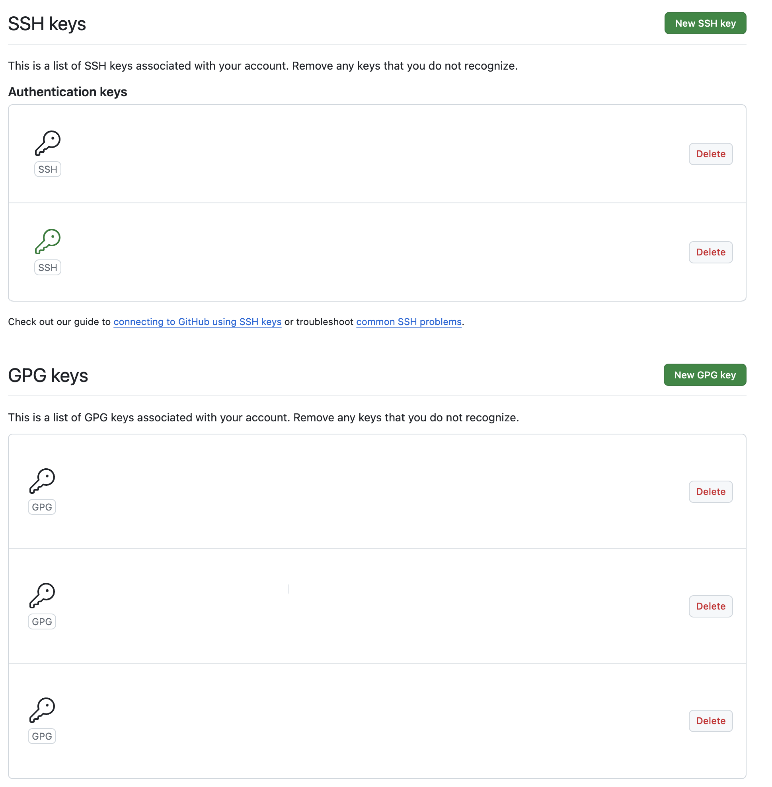

# Dotfiles
[](https://github.com/ttiimmothy/dotfiles/actions/workflows/ci.yml)

Dotfiles is for storing my dotfiles for setting up a new computer.

## Contents

- [Shell setup](#shell-setup)
- [Terminal configuration](#terminal-configuration)
- [Dotfiles](#dotfiles-current)
- [Git configuration](#git-configuration)
- [Create symlink (symbolic link)](#create-symlinks-in-the-home-directory-to-the-real-files-in-the-repo)
- [Reminders](#reminders)
- [License](#license)

### Requirements

- a terminal that support true color and *undercurl*:
  - [iterm](https://iterm2.com/) **(macOS)**

## Shell setup
**(macOS)**

### ohmyzsh framework for zsh shell (optional for installing, fish shell is good enough to use)

- [ohmyzsh](https://ohmyz.sh/)
- [powerlevel10k](https://github.com/romkatv/powerlevel10k) - In this repository, the **Nerd fonts** can be downloaded directly
- [Nerd fonts](https://github.com/ryanoasis/nerd-fonts) - Powerline-patched fonts. I use Hack. It can be directly downloaded without using `homebrew`, so **Don't** do `brew install font-hack-nerd-font`. It will consume more storages by installing from `homebrew`.


### Fish shell

- [Fish shell](https://fishshell.com/)
- [Fisher](https://github.com/jorgebucaran/fisher) - Plugin manager
- [Tide](https://github.com/IlanCosman/tide) - Shell theme. Use version 5: `fisher install ilancosman/tide@v5`
- [Nerd fonts](https://github.com/ryanoasis/nerd-fonts) - Powerline-patched fonts. I use Hack. It can be directly downloaded without using `homebrew`, so **Don't** do `brew install font-hack-nerd-font`. It will consume more storages by installing from `homebrew`.
- [Exa](https://github.com/ogham/exa) - `ls` replacement
- [Peco](https://github.com/peco/peco) - Interactive filtering

#### Commands for installing `exa` and `peco`

```bash
brew install exa
brew install peco
```

##### Optional installation for `fish shell`

- [ghq](https://github.com/x-motemen/ghq) - Local Git repository organizer
- [fzf](https://github.com/PatrickF1/fzf.fish) - Interactive filtering, `peco` replacement
- [Eza](https://github.com/eza-community/eza) - `ls` replacement, `exa` replacement
- [z for fish](https://github.com/jethrokuan/z) - Directory jumping

### Font Installation

#### Manual font installation

1. Download these four ttf files:
   - [MesloLGS NF Regular.ttf](
       https://github.com/romkatv/powerlevel10k-media/raw/master/MesloLGS%20NF%20Regular.ttf)
   - [MesloLGS NF Bold.ttf](
       https://github.com/romkatv/powerlevel10k-media/raw/master/MesloLGS%20NF%20Bold.ttf)
   - [MesloLGS NF Italic.ttf](
       https://github.com/romkatv/powerlevel10k-media/raw/master/MesloLGS%20NF%20Italic.ttf)
   - [MesloLGS NF Bold Italic.ttf](
       https://github.com/romkatv/powerlevel10k-media/raw/master/MesloLGS%20NF%20Bold%20Italic.ttf)
1. Double-click on each file and click "Install". This will make `MesloLGS NF` font available to all
   applications on your system.
1. Set the `terminal` and `iterm` to use these fonts in the settings

## Terminal configuration
### ANSI color configuration for both `terminal` and `iterm`

- yellow normal: **#ffc83e**
- yellow bright: **#ff9300**
- blue normal: **#0096ff**
- blue bright: **#6871ff**

###### need to change the color because the default color is difficult to see when using `ll` or `lla` command

### window size and font size

- window
  - `terminal` **176 * 49**
  - `iterm` **178 * 50**

- font
  - `terminal` **MesloLGS NF Regular *9***
  - `iterm` **MesloLGS NF Regular *9***

### other configurations

#### terminal




#### iterm





### Images for fish shell


## dotfiles current

1. [.profile](.profile)
1. [.zprofile](.zprofile)
1. [.zshrc](.zshrc)

### Old versions of dotfiles

1. [.profile](.profile)
1. [.zprofile](.zprofile)
1. [.zshrc](core/.zshrc)
1. [.p10k.zsh](core/.p10k.zsh)
1. [.bashrc](core/.bashrc)
1. [.bash_profile](core/.bash_profile)

### Software installation (let the dotfiles work)

1. [homebrew](https://brew.sh/)
1. [git](https://git-scm.com/download/mac)
1. [node.js, npm](https://nodejs.org/en)
1. [go](https://go.dev/)
1. [bun](https://bun.sh/)
1. [gnupg](https://www.gnupg.org/download/) (for **`--gpg-sign`** tag in git commit)
1. [cargo](https://doc.rust-lang.org/cargo/getting-started/installation.html) (`rust` package manager)

#### Images showing the things installed by brew


`git`

`exa`

`fish`

`peco`

`neovim`

[`git-lfs (optional)`](https://git-lfs.com/)

###### other softwares showing in the above image are default downloaded after installing `brew` and other softwares that mentioned above (like `luv` is installed itself after installing `neovim`), `don't` need to run `brew install $(software-name)`

## Git configuration

- [ ] generate `ssh key` in new machine

```bash
ssh-keygen
```

- [ ] the key is stored in `$HOME/.ssh/id_rsa.pub` or `~/.ssh/id_rsa/pub`, paste it to [gitlab settings](https://github.com/settings/keys) and `gitlab` (if you're using)

- [ ] [`.env.example`](.env.example) stores the `.gitconfig` configurations and `.gitconfig` is gitignored due to privacy



- [ ] `GPG (GNU Privacy Guard) key` is stored in `~/.gnupg` after installation

## Create symlinks in the Home directory to the real files in the repo

```zsh
# There are better and less manual ways to do this;
# investigate install scripts and bootstrapping tools.

ln -s ~/.dotfiles/.zshrc ~/.zshrc
ln -s ~/.dotfiles/.gitconfig ~/.gitconfig
ln -s ~/.dotfiles/.profile ~/.profile
ln -s ~/.dotfiles/.zprofile ~/.zprofile
ln -s ~/.dotfiles/.config/fish/config.fish ~/.config/fish/config.fish
ln -s ~/.dotfiles/.config/fish/config-osx.fish ~/.config/fish/config-osx.fish
ln -s ~/.dotfiles/.config/fish/functions/fish_user_key_bindings.fish ~/.config/fish/functions/fish_user_key_bindings.fish
ln -s ~/.dotfiles/.config/fish/functions/peco_select_history.fish ~/.config/fish/functions/peco_select_history.fish
mkdir ~/.config/peco
ln -s ~/.dotfiles/.config/peco/config.json ~/.config/peco/config.json
git clone git@github.com:ttiimmothy/vscode-settings.json ~/.vscode_settings
ln -s ~/.vscode_settings/vscode/settings.json ~/Library/Application\ Support/Code/User/settings.json
```

## Reminders

- Need to update the `iterm` and `terminal` **ANSI Colors** according the above configurations directly
- [`.config/fish/conf.d/tide.fish`](.config/fish/conf.d/tide.fish) is required to copy the lines and paste to terminal to make it be functional
- Need to copy the `.gitconfig` from this repo in the own machine because now it is gitignored

how to get the software downloaded by `brew`

```bash
brew bundle dump --describe
```

#### Also check

[ttiimmothy/install](https://github.com/ttiimmothy/install) - Software to install

[ttiimmothy/use](https://github.com/ttiimmothy/use) - Things I am using

[ttiimmothy/vscode-settings](https://github.com/ttiimmothy/vscode-settings) - My Visual Studio Code settings and extensions

<https://www.youtube.com/watch?v=r_MpUP6aKiQ&t=573s>

- [ ] [dotfiles from others](https://github.com/eieioxyz/Beyond-Dotfiles-in-100-Seconds)
- [ ] [dotfiles from others](https://github.com/craftzdog/dotfiles-public)

## License

Dotfiles is licensed under [GNU General Public License v3.0](LICENSE).