# Dotfiles (stow)
[](https://github.com/ttiimmothy/dotfiles-stow/actions/workflows/ci.yml)

Dotfiles (stow) is for storing my dotfiles for setting up a new computer.

### Sample iterm view

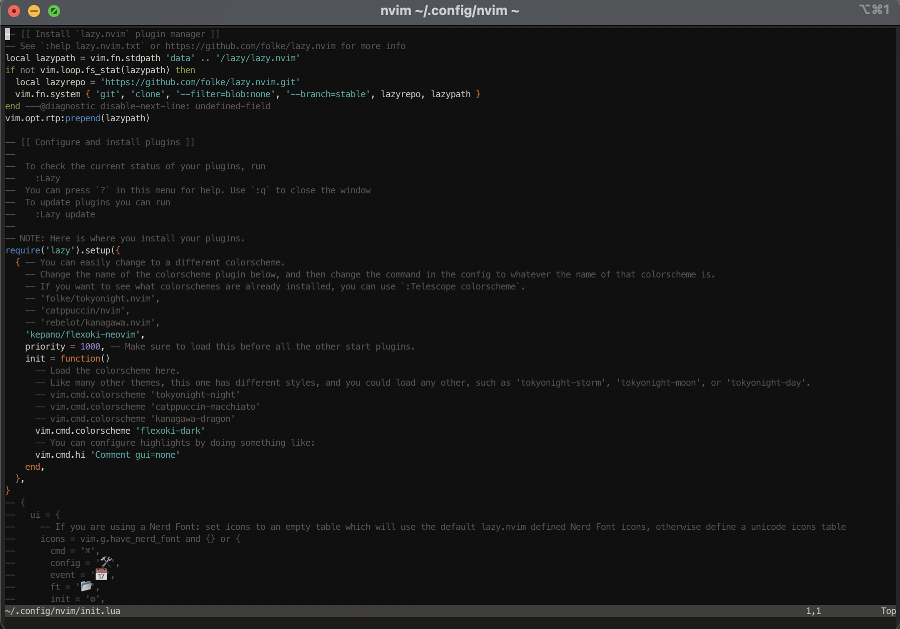

## Contents

- [Shell setup](#shell-setup)
- [Terminal configuration](#terminal-configuration)
- [Dotfiles](#dotfiles-current)
- [Git configuration](#git-configuration)
- [Create symlink (symbolic link)](#create-symlinks-in-the-home-directory)
- [Reminders](#reminders)
- [License](#license)

### Requirements

- a terminal that support true color and *undercurl*:
  - [iterm](https://iterm2.com/) **(macOS)**
  - [ghostty](https://ghostty.org/download)

## Shell setup
**(macOS)**

### ohmyzsh framework for zsh shell (optional for installing, fish shell is good enough to use)

- (**not used**) [ohmyzsh](https://ohmyz.sh/)
- (**not used**) [powerlevel10k](https://github.com/romkatv/powerlevel10k) - In this repository, the **Nerd fonts** can be downloaded directly
- [Nerd fonts](https://github.com/ryanoasis/nerd-fonts) - Powerline-patched fonts. It can be directly downloaded from the [files](#font-installation) below without using `homebrew`, so **Don't** do `brew install font-hack-nerd-font`. It will consume more storages by installing from `homebrew`.

### Fish shell

- [Fish shell](https://fishshell.com/)
- [Fisher](https://github.com/jorgebucaran/fisher) - Plugin manager
- [Tide](https://github.com/IlanCosman/tide) - Shell theme
- [Nerd fonts](https://github.com/ryanoasis/nerd-fonts) - Powerline-patched fonts. It can be directly downloaded from the [files](#font-installation) below without using `homebrew`, so **Don't** do `brew install font-hack-nerd-font`. It will consume more storages by installing from `homebrew`.
- [Eza](https://github.com/eza-community/eza) - `ls` replacement
- [Peco](https://github.com/peco/peco) - Interactive filtering
- [Zoxide](https://github.com/ajeetdsouza/zoxide) - Directory jumping, `cd` replacement with extensive features

#### Commands for installing `eza` and `peco`

```bash
brew install eza
brew install peco
```

##### Optional installation for `fish shell`

- [ghq](https://github.com/x-motemen/ghq) - Local Git repository organizer
- [fzf](https://github.com/PatrickF1/fzf.fish) - Interactive filtering, fuzzy finder in fish shell
- [z for fish](https://github.com/jethrokuan/z) - Directory jumping, `cd` replacement with extensive features

##### Depreciated

- [Exa](https://github.com/ogham/exa) - `ls` replacement

### Font Installation

#### Manual font installation

1. Download these four ttf files:
    - [MesloLGS NF Regular.ttf](
       https://github.com/romkatv/powerlevel10k-media/raw/master/MesloLGS%20NF%20Regular.ttf)
    - [MesloLGS NF Bold.ttf](
       https://github.com/romkatv/powerlevel10k-media/raw/master/MesloLGS%20NF%20Bold.ttf)
    - [MesloLGS NF Italic.ttf](
       https://github.com/romkatv/powerlevel10k-media/raw/master/MesloLGS%20NF%20Italic.ttf)
    - [MesloLGS NF Bold Italic.ttf](
       https://github.com/romkatv/powerlevel10k-media/raw/master/MesloLGS%20NF%20Bold%20Italic.ttf)
1. Double-click on each file and click "Install". This will make `MesloLGS NF` font available to all
   applications on your system.
1. Set the `terminal` and `iterm` to use these fonts in the settings

### Neovim color

- [x] [rose-pine/neovim](https://github.com/rose-pine/neovim)

- [ ] can also check: <https://github.com/topics/neovim-colorscheme>

### Default shell setup (from `zsh` to `fish`, by `chsh` command)

- [ ] change /etc/shells files by adding **/opt/homebrew/bin/fish** or where you install the fish
- [ ] type following command

```bash
chsh
```

- [ ] change the default shell to fish in the file that you open
- [ ] logout and login again, the default shell would change to **`fish`** now, don't need to add `fish` in `.zshrc` anymore

## Terminal configuration
### ANSI color configuration for both `terminal` and `iterm`

- yellow normal: **#ffc83e**
- yellow bright: **#ff9300**
- blue normal: **#0096ff**
- blue bright: **#6871ff**
- `terminal`: **#151515** **opacity 99%** **blur 20%**, `iterm`: **#171717** **transparency 8%** **blur 20%**

###### need to change the color because the default color is difficult to see when using `ll` or `lla` command

### window size and font size

- window
  - `terminal` **258 * 87**
  - `iterm` **258 * 87**

- font
  - `terminal` **MesloLGS NF Regular `10`**
  - `iterm` **MesloLGS NF Regular `10`**

### other configurations

#### terminal

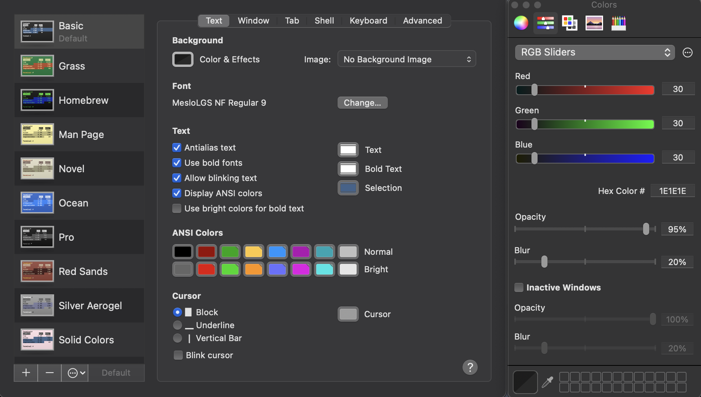
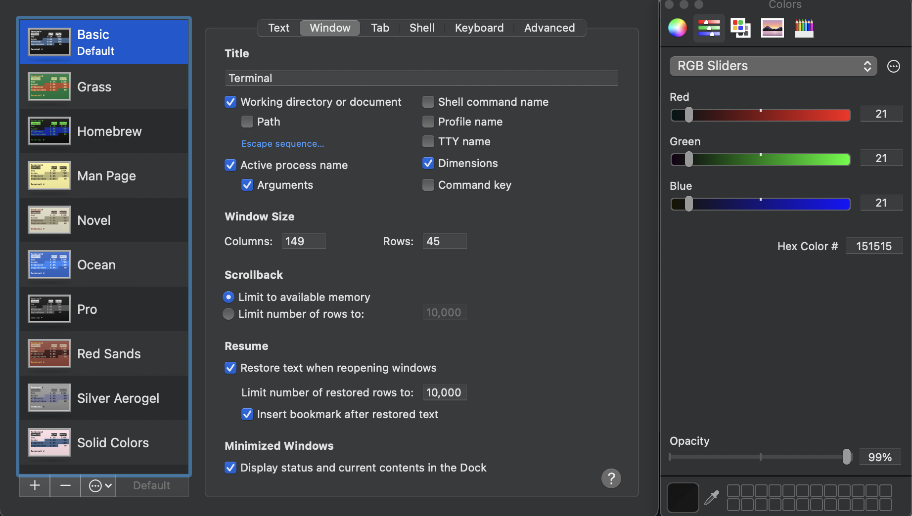

#### iterm

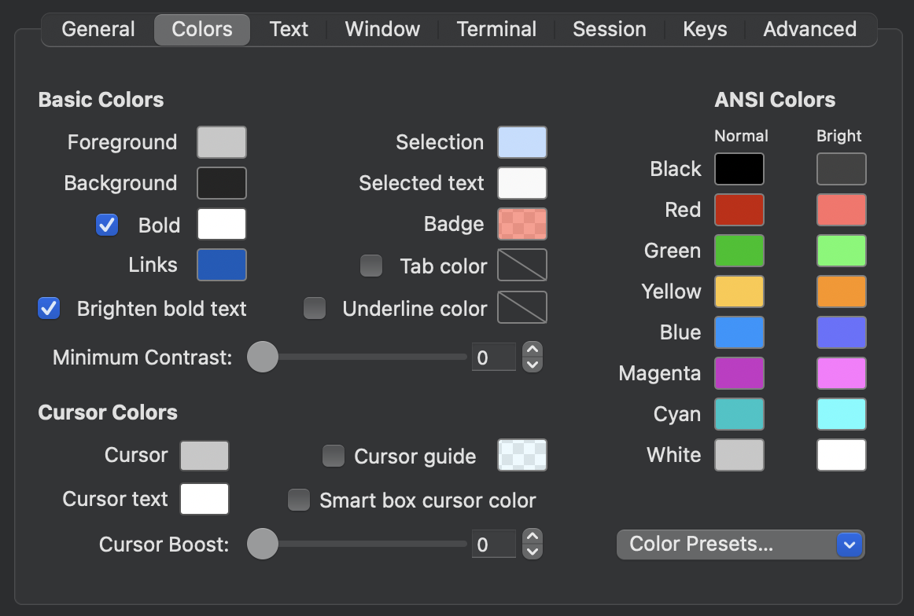
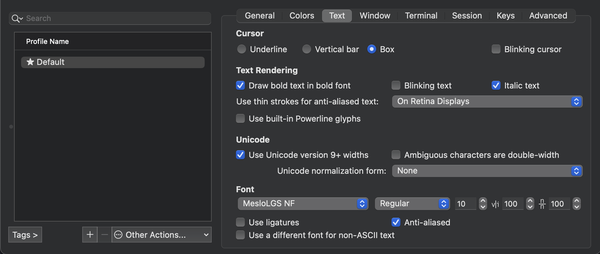
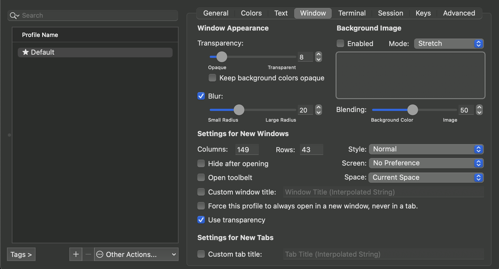

### Images for fish shell

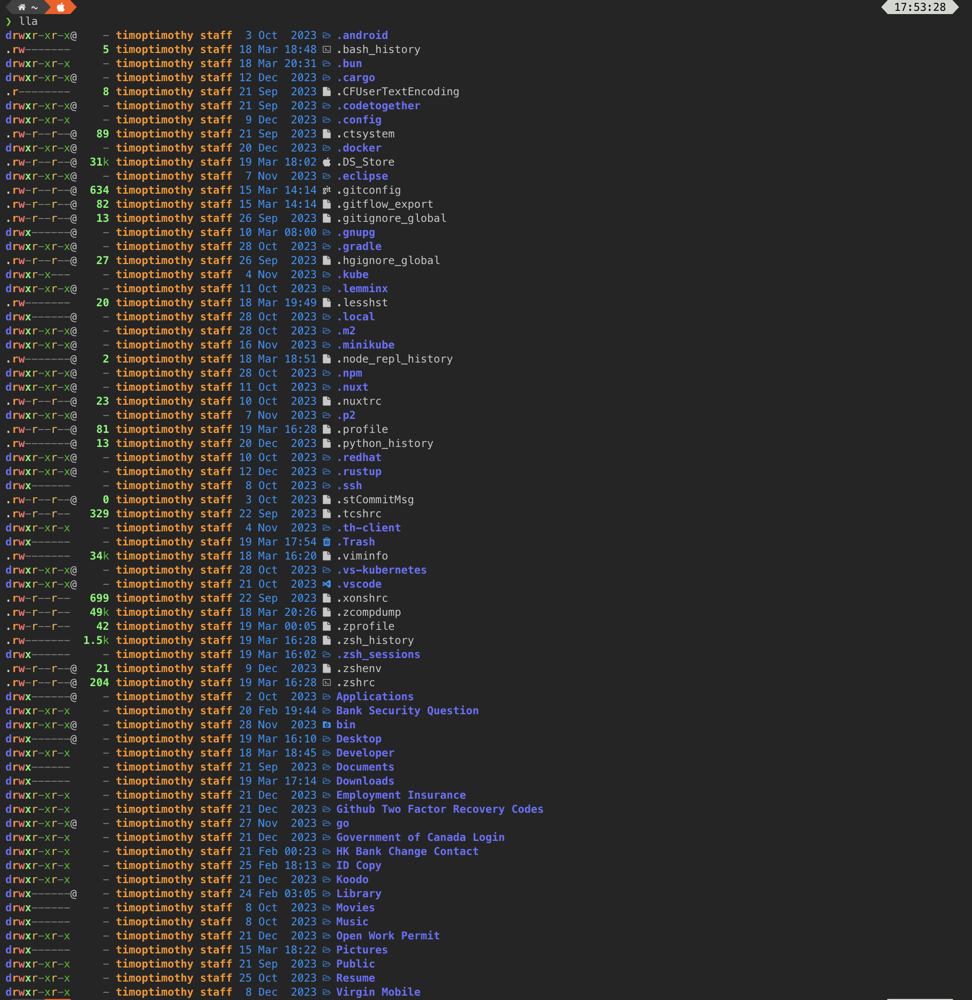
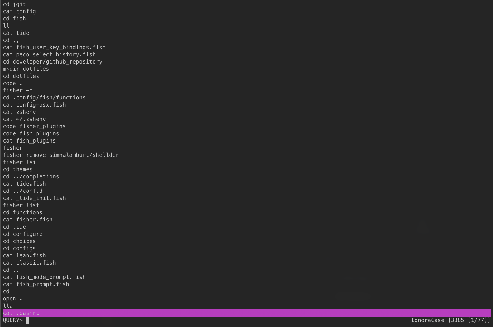

## dotfiles (current)

1. [.profile](.profile)
1. [.zprofile](.zprofile)
1. [.zshrc](.zshrc)
1. [.zshenv](.zshenv)
1. [.gitconfig](.gitconfig)
1. [fish_user_key_bindings.fish](.config/fish/functions/fish_user_key_bindings.fish)
1. [peco_select_history.fish](.config/fish/functions/peco_select_history.fish)
1. [config-osx-eza.fish](.config/fish/config-osx-eza.fish)
1. [config-alias.fish](.config/fish/config-alias.fish)
1. [config.fish](.config/fish/config.fish)
1. [tide.fish](.config/fish/conf.d/tide.fish)
1. [docker.fish](.config/fish/completions/docker.fish)
1. [nvim/init.lua](.config/nvim/init.lua)
1. [shortlisted.lua](.config/nvim/lua/various/plugins/shortlisted.lua)
1. [lspconfiguration.lua](.config/nvim/lua/various/plugins/lspconfiguration.lua)
1. [peco/config.json](.config/peco/config.json)
1. [tmux.conf](.config/tmux/tmux.conf)
1. [tmux/macos.conf](.config/tmux/macos.conf)
1. [tmux/status_line.conf](.config/tmux/status_line.conf)
1. [tmux/utility.conf](.config/tmux/utility.conf)
1. [karabiner.json](.config/karabiner/karabiner.json)
1. [.warp/themes/color_dark.yml](.warp/themes/color_dark.yml)
1. [.warp/themes/color_light.yml](.warp/themes/color_light.yml)
1. [.warp/themes/my_color.yml](.warp/themes/my_color.yml)
1. [alacritty.toml](.config/alacritty/alacritty.toml)
1. [config](.config/ghostty/config)

### dotfiles (old)

1. [.profile](core/.profile)
1. [.zprofile](core/.zprofile)
1. [.zshrc](core/.zshrc)
1. [.p10k.zsh](core/.p10k.zsh)
1. [.bashrc](core/.bashrc)
1. [.bash_profile](core/.bash_profile)
1. [nvim](https://github.com/ttiimmothy/nvim)
1. [configstore/nodemon.json](core/.config/configstore/nodemon.json)

### Software installation (let the dotfiles work)

1. [homebrew](https://brew.sh/)
1. [git](https://git-scm.com/download/mac)
1. [node.js, npm](https://nodejs.org/en)
1. [go](https://go.dev/)
1. [pnpm](https://pnpm.io/installation) - Use command `curl -fsSL https://get.pnpm.io/install.sh | sh -`
1. [neofetch](https://github.com/dylanaraps/neofetch/wiki/Installation) - Use universal install `make PREFIX=$HOME/.local install`
1. [gnupg](https://www.gnupg.org/download/) (for **`--gpg-sign`** tag in git commit)
1. [stow](https://www.gnu.org/software/stow/) - After installing `tar`, use command `./configure --prefix=$HOME/.local && make install`
1. [Raycast](https://raycast.com/)
1. [Karabiner-elements](https://karabiner-elements.pqrs.org/) - Keys modification
1. [iTerm](https://iterm2.com/)

#### Images showing the things installed by brew

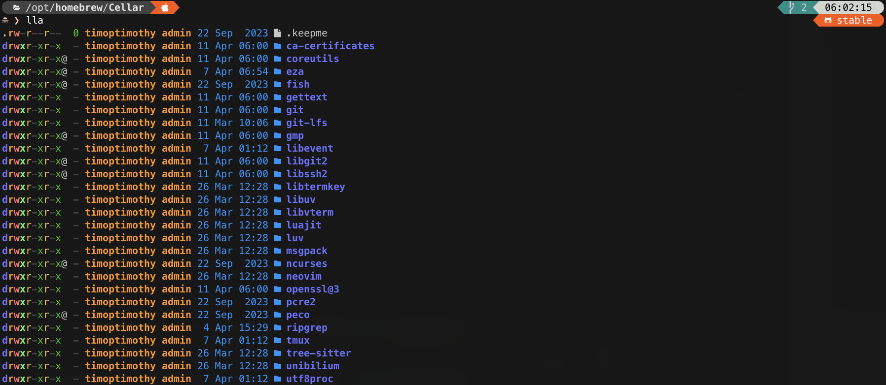
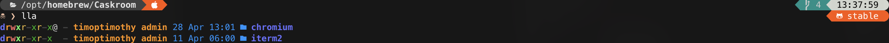

`git`

`pnpm`

`fish`

`neovim`

`eza`

`peco`

`ripgrep` (**important for neovim telescope searching**)

`tmux`

[`git-lfs (optional)`](https://git-lfs.com/)

`iterm` (**it can be downloaded from the software homepage without homebrew**)

`chromium`

###### other softwares showing in the above image are default downloaded after installing `brew` and other softwares that mentioned above (like `luv` is installed itself after installing `neovim`), `don't` need to run `brew install $(software-name)`

## Git configuration

- [ ] generate `ssh key` in new machine

```bash
ssh-keygen
```

- [ ] the key is stored in `$HOME/.ssh/id_rsa.pub` or `~/.ssh/id_rsa/pub`, paste it to [gitlab settings](https://github.com/settings/keys) and `gitlab` (if you're using)

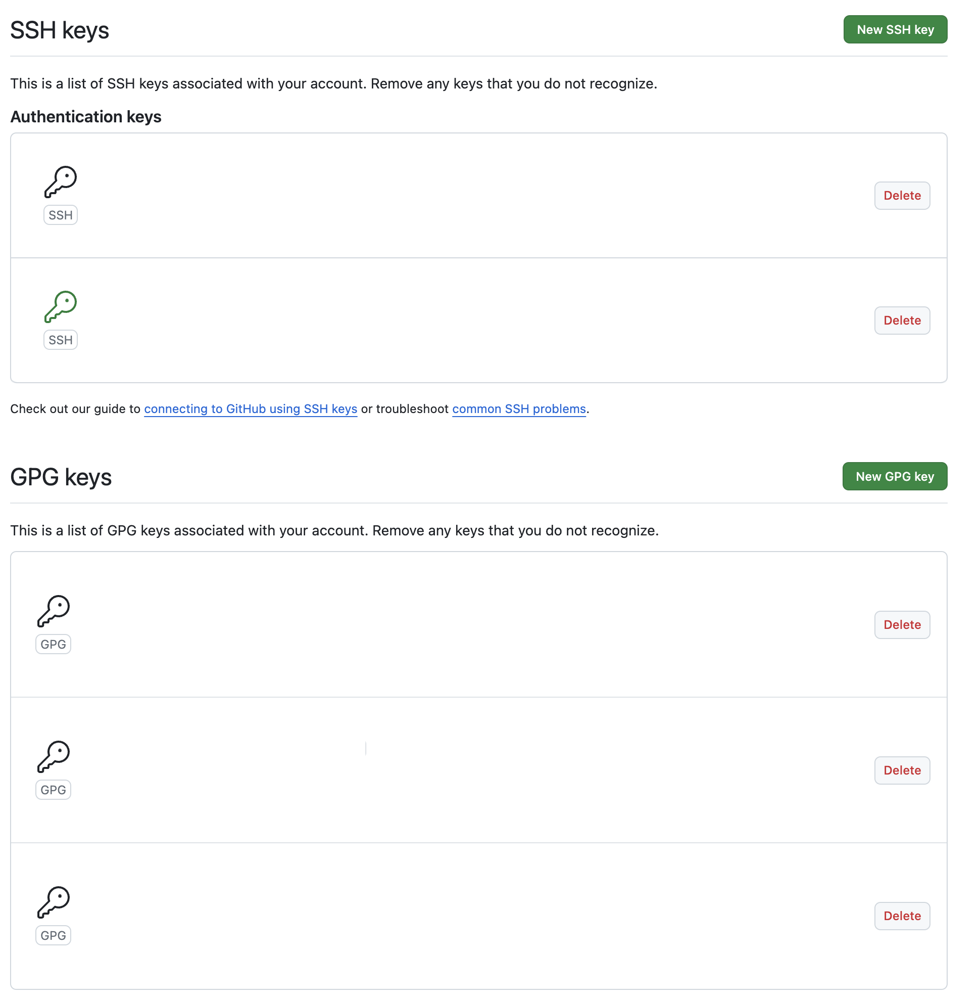

- [ ] `GPG (GNU Privacy Guard) key` is stored in `~/.gnupg` after installation

## Create symlinks in the home directory

```zsh
stow .
ln -s ~/developer/github_repository/vscode_settings/vscode/settings.json ~/Library/Application\ Support/Code/User/settings.json
```

## Reminders

- Need to update the `iterm` and `terminal` **ANSI Colors** according the above configurations directly
- Need to copy the `.gitconfig` from this repo in the own machine because now it is gitignored
- `fish_config` command can open a window to display all fish shell color variables
- `tide configure` command can reset and customize the fish shell tide theme

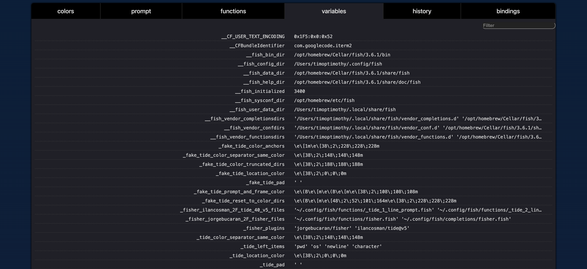
**(by `fish_config`)**

how to get the software downloaded by `brew`

```bash
brew bundle dump --describe
```

check `zoxide` weight

```bash
zoxide query -l -s
```

#### Installing `tmux` require following dependencies (depreciated, download `tmux` with brew after trying manual install)

[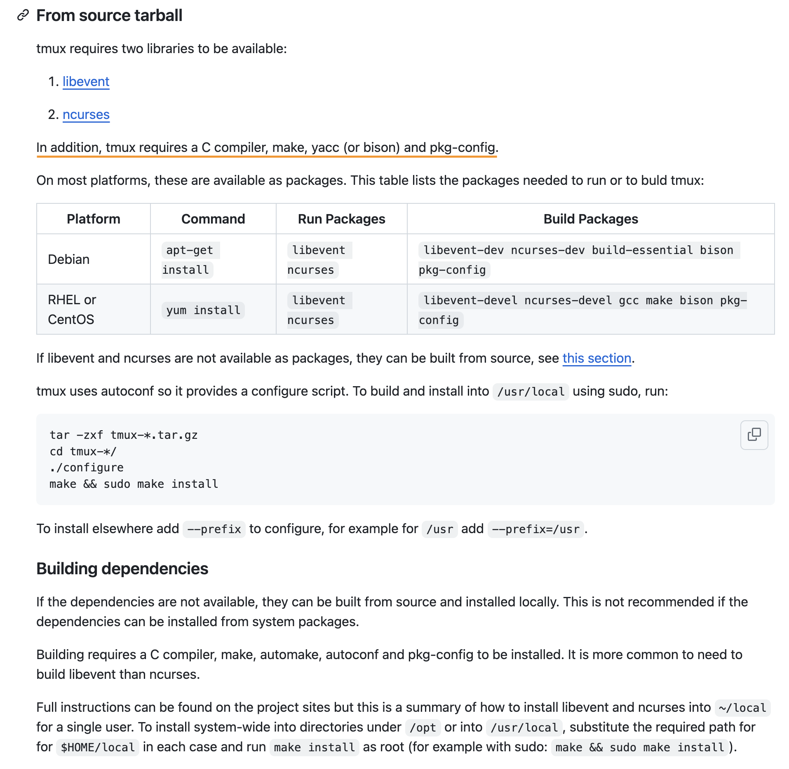](https://github.com/tmux/tmux/wiki/Installing#building-dependencies)

#### Also check

[ttiimmothy/install](https://github.com/ttiimmothy/install) - Software to install

[ttiimmothy/use](https://github.com/ttiimmothy/use) - Things I am using

[ttiimmothy/vscode-settings](https://github.com/ttiimmothy/vscode-settings) - My Visual Studio Code settings and extensions

[ANSI Shadow Font](https://www.patorjk.com/software/taag/#p=display&f=ANSI%20Shadow&t=timoptimothy)

## License

Dotfiles (stow) is licensed under [GNU General Public License v3.0](LICENSE).
