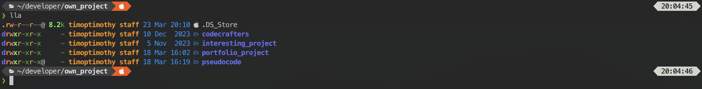

# Dotfiles
[](https://github.com/ttiimmothy/dotfiles/actions/workflows/ci.yml)

Dotfiles is for storing my dotfiles for setting up a new computer.

## Contents

- [fish config](#shell-setup)
- [dotfiles](#dotfiles)
- [Reminders](#reminders)
- [References](#references)
- [License](#license)

### Requirements

- a terminal that support true color and *undercurl*:
  - [iterm2](https://iterm2.com/) **(macOS)**

## Shell setup
<!-- **(macOS & Linux)** -->
**(macOS)**

### ohmyzsh framework for zsh shell (optional for installing, fish shell is good enough to use)

- [ohmyzsh](https://ohmyz.sh/)
- [powerlevel10k](https://github.com/romkatv/powerlevel10k) - In this repository, the **Nerd fonts** can be downloaded directly
- [Nerd fonts](https://github.com/ryanoasis/nerd-fonts) - Powerline-patched fonts. I use Hack. It can be directly downloaded without using `homebrew`, so **Don't** do `brew install font-hack-nerd-font`. It will consume more storages by installing from `homebrew`.


### Fish shell

- [Fish shell](https://fishshell.com/)
- [Fisher](https://github.com/jorgebucaran/fisher) - Plugin manager
- [Tide](https://github.com/IlanCosman/tide) - Shell theme. Use version 5: `fisher install ilancosman/tide@v5`
- [Nerd fonts](https://github.com/ryanoasis/nerd-fonts) - Powerline-patched fonts. I use Hack. It can be directly downloaded without using `homebrew`, so **Don't** do `brew install font-hack-nerd-font`. It will consume more storages by installing from `homebrew`.
- [Exa](https://github.com/ogham/exa) - `ls` replacement
- [Peco](https://github.com/peco/peco) - Interactive filtering
<!-- - [ghq](https://github.com/x-motemen/ghq) - Local Git repository organizer
- [fzf](https://github.com/PatrickF1/fzf.fish) - Interactive filtering -->
<!-- - [Eza](https://github.com/eza-community/eza) - `ls` replacement -->
<!-- - [z for fish](https://github.com/jethrokuan/z) - Directory jumping -->

### Font Installation

#### Manual font installation

1. Download these four ttf files:
   - [MesloLGS NF Regular.ttf](
       https://github.com/romkatv/powerlevel10k-media/raw/master/MesloLGS%20NF%20Regular.ttf)
   - [MesloLGS NF Bold.ttf](
       https://github.com/romkatv/powerlevel10k-media/raw/master/MesloLGS%20NF%20Bold.ttf)
   - [MesloLGS NF Italic.ttf](
       https://github.com/romkatv/powerlevel10k-media/raw/master/MesloLGS%20NF%20Italic.ttf)
   - [MesloLGS NF Bold Italic.ttf](
       https://github.com/romkatv/powerlevel10k-media/raw/master/MesloLGS%20NF%20Bold%20Italic.ttf)
1. Double-click on each file and click "Install". This will make `MesloLGS NF` font available to all
   applications on your system.
1. Set the `terminal` and `iterm` to use these fonts in the settings

### Terminal color configuration for both terminal and iterm

- yellow normal: **#ffc83e**
- yellow bright: **#ff9300**
- blue normal: **#0096ff**
- blue bright: **#6871ff**

###### need to change the color because the default color is difficult to see when using `ll` or `lla` command

### Commands

```bash
brew install exa
brew install peco
```

### Images for fish shell




## dotfiles

1. [.profile](.profile)
1. [.zprofile](.zprofile)
1. [.zshrc](.zshrc)

### Old versions of dotfiles

1. [.profile](.profile)
1. [.zprofile](.zprofile)
1. [.zshrc](core/.zshrc)
1. [.p10k.zsh](core/.p10k.zsh)
1. [.bashrc](core/.bashrc)
1. [.bash_profile](core/.bash_profile)

### Software installation (let the dotfiles work)

1. [homebrew](https://brew.sh/)
1. [git](https://git-scm.com/download/mac)
1. [node.js, npm](https://nodejs.org/en)
1. [go](https://go.dev/)
1. [bun](https://bun.sh/)
1. [gnupg](https://www.gnupg.org/download/) (for **`--gpg-sign`** tag in git commit)
1. [cargo](https://doc.rust-lang.org/cargo/getting-started/installation.html) (for `rust` package manager)

#### Images showing the things installed by brew


`git`

`exa`

`fish`

`peco`

`git-lfs`(optional)

## Reminders

- Need to change the iterm2 terminal color according the above configurations directly
- [tide.fish](.config/fish/conf.d/tide.fish) is required to copy the lines and paste to terminal to make it be functional

## References

<https://github.com/craftzdog/dotfiles-public>

#### Also check

[ttiimmothy/installs](https://github.com/ttiimmothy/install) - Software to install

[ttiimmothy/vscode-settings-extensions](https://github.com/ttiimmothy/vscode-settings-extensions) - My VS Code settings and extensions

## License

Dotfiles is licensed under [GNU General Public License v3.0](LICENSE).